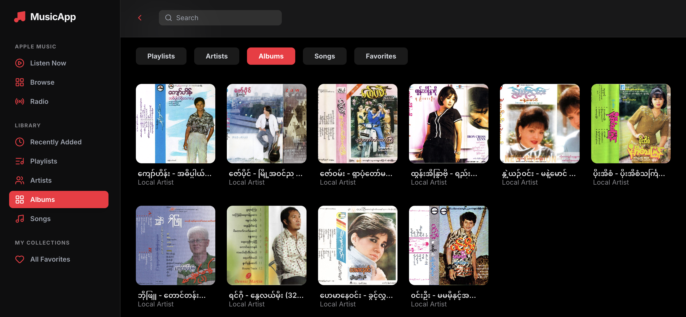
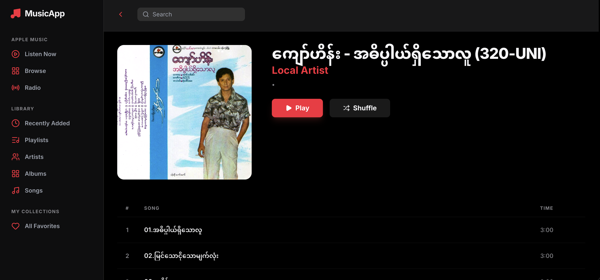
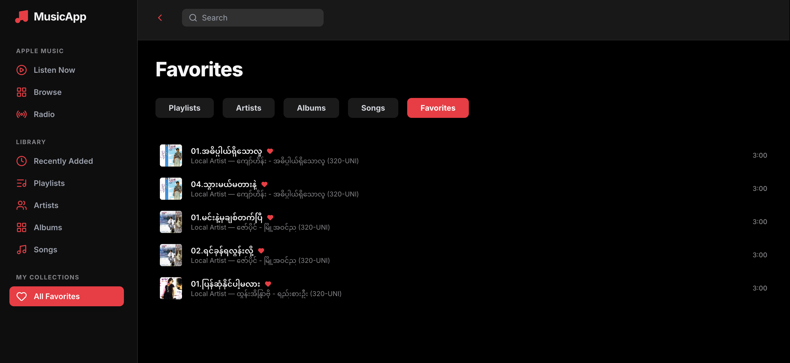

# Music App (Apple Music–style)

A full‑stack Apple Music–style web player with a FastAPI backend, React (Vite) frontend, Cloudflare R2 object storage, and PostgreSQL metadata.

**Live**: https://music.kyawhtet.com

## Features
- Album + track browsing
- Streaming playback (presigned R2 URLs)
- Favorites / liked tracks
- Search and library views
- Cloudflare R2 for audio + artwork

## Stack
- Frontend: React + Vite + Tailwind
- Backend: FastAPI
- Storage: Cloudflare R2
- DB: PostgreSQL

## Screenshots
### Albums

### Playlists

### Favorites

## Local Development
### Backend
1. `cd backend`
2. `python3 -m venv venv && source venv/bin/activate`
3. `pip install -r requirements.txt`
4. `uvicorn app.main:app --reload`

### Frontend
1. `cd frontend`
2. `npm install`
3. `npm run dev`

## Deployment Notes
- API base URL is controlled by `VITE_API_BASE_URL`.
- VPS backend runs via `systemd` on port `8000` and is proxied by nginx.

